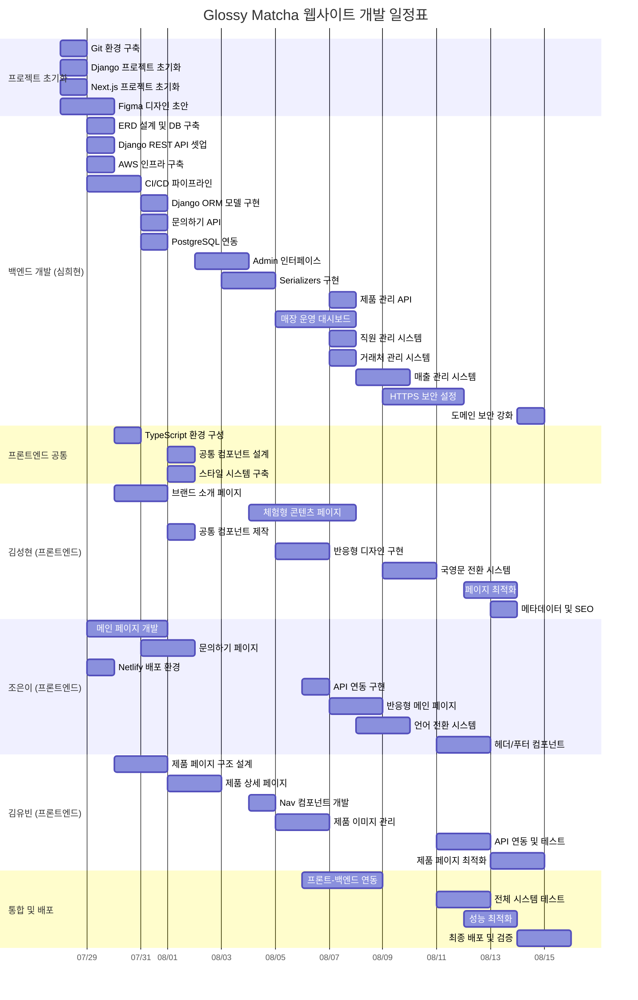

# Glossy Matcha - 프리미엄 말차 브랜드 웹사이트


## **🍵 제주의 프리미엄 말차를 경험할 수 있는 브랜드 웹사이트(외부 MVP)**

## **📠 매장 운영 관리 시스템(내부 MVP)**

## 1. 📌 프로젝트 개요

**Glossy Matcha**는 **듀얼 MVP 아키텍처**를 기반으로 한 풀스택 비즈니스 솔루션입니다.

### 🌍 External MVP - 브랜드 웹사이트

**타겟**: 글로벌 고객 및 잠재 고객  
**목적**: 제주 프리미엄 말차 브랜드의 디지털 프레젠스 구축 및 브랜드 가치 전달  
**핵심 가치**: 브랜드 아이덴티티, 고객 경험, 글로벌 접근성

### 🏢 Internal MVP - 매장 운영 대시보드

**타겟**: 내부 운영진 및 관리자  
**목적**: 실시간 비즈니스 인텔리전스 및 운영 효율성 극대화  
**핵심 가치**: 데이터 기반 의사결정, 업무 자동화, 운영 최적화

### 🔗 통합 생태계

두 MVP가 RESTful API를 통해 완벽하게 연동되어, **고객 접점에서 운영 백엔드까지의 끊김 없는 비즈니스 플로우**를 구현합니다. 현대적인 웹 기술 스택을 활용하여 확장 가능하고 유지보수성이 뛰어난 엔터프라이즈 급 솔루션을 제공합니다.

### 🎯 프로젝트 목표

- **브랜드 아이덴티티 강화**: 제주 프리미엄 말차 브랜드의 고급스러운 이미지 구축
- **글로벌 접근성**: 한국어/영어 다국어 지원으로 해외 시장 진출 준비
- **비즈니스 효율성**: Django 기반 매장 운영 대시보드로 실무 운영 최적화
- **고객 경험 향상**: 인터랙티브한 체험형 콘텐츠와 직관적인 UI/UX 제공

---

## 2. 🏡 팀 소개

| 이름   | 사진                                                                                 | 깃허브 주소                                          | 담당 파트                                                                                     |
| ------ | ------------------------------------------------------------------------------------ | ---------------------------------------------------- | --------------------------------------------------------------------------------------------- |
| 심희현 |    | [@Elarin22](https://github.com/Elarin22)             | Django 백엔드, AWS 인프라, 매장 운영 시스템, API 설계, 메인 페이지 브랜드 영상 편집           |
| 김성현 |  | [@seonghyeon1022](https://github.com/seonghyeon1022) | 브랜드 소개/체험형 콘텐츠 페이지 디자인 및 구현, 다국어 시스템, 공통 컴포넌트                 |
| 조은이 |    | [@chohc](https://github.com/chohc)                   | 메인 페이지/문의하기 페이지 디자인 및 구현, 헤더/푸터, API 연동, 다국어 시스템, 공통 컴포넌트 |
| 김유빈 |    | [@6wol](https://github.com/6wol)                     | 메인 페이지 디자인, 제품 페이지 디자인 및 개발, API 연동, 다국어 시스템, 공통 컴포넌트        |

---

## 3. 💡 기술 스택

<div align=left>
   
  
  
  
  <br>
  
   
   
   
  
  <br>
  
   
  
  
  <br>

  
  
  
  <br>

   
   
  
  <br>
  
  
  
  
</div>

---

## 4. 🎨 개발 환경

- **개발 도구**:

    
    

- **프론트엔드 프레임워크**:

    
    
    

- **백엔드 프레임워크**:

    
    
    

- **배포 환경**:

    
    
    
    

- **협업 툴**:

    
    
    
    
    

---

## 5. 📅 개발 일정

**개발 기간**: 2025년 7월 28일 ~ 2025년 8월 15일 (19일간)



---

## 6. 📂 프로젝트 구조

<details>
<summary>프로젝트 폴더 구조</summary>

```
Glossy_Matcha/
├── be/                              # Django 백엔드
│   ├── glossy/                      # 프로젝트 설정
│   │   ├── settings.py              # Django 설정
│   │   ├── urls.py                  # 메인 URL 라우팅
│   │   └── wsgi.py                  # WSGI 설정
│   ├── glossymatcha/                # 메인 앱
│   │   ├── models.py                # 데이터베이스 모델
│   │   ├── views.py                 # 뷰 로직 (API + 템플릿)
│   │   ├── serializers.py           # DRF 시리얼라이저
│   │   ├── urls.py                  # 앱 URL 라우팅
│   │   ├── admin.py                 # Django Admin 설정
│   │   ├── forms.py                 # Django Forms
│   │   └── templates/               # Django 템플릿
│   │       └── glossymatcha/
│   │           ├── base.html        # 기본 템플릿
│   │           ├── dashboard.html   # 대시보드
│   │           ├── staff/           # 직원 관리 템플릿
│   │           ├── suppliers/       # 거래처 관리 템플릿
│   │           ├── sales/           # 매출 관리 템플릿
│   │           └── inquiries/       # 문의 관리 템플릿
│   ├── static/                      # 정적 파일
│   ├── media/                       # 업로드 파일
│   ├── db.sqlite3                   # SQLite 데이터베이스
│   └── manage.py                    # Django 관리 명령어
├── fe/                              # Next.js 프론트엔드
│   ├── src/
│   │   ├── app/                     # App Router 페이지
│   │   │   ├── [locale]/            # 다국어 라우팅
│   │   │   │   ├── page.tsx         # 메인 페이지
│   │   │   │   ├── about/           # 브랜드 소개
│   │   │   │   ├── products/        # 제품 페이지
│   │   │   │   ├── glossypick/      # 체험형 콘텐츠
│   │   │   │   └── inquire/         # 문의하기
│   │   │   └── layout.tsx           # 루트 레이아웃
│   │   ├── components/              # React 컴포넌트
│   │   │   ├── Header/              # 헤더 컴포넌트
│   │   │   ├── Footer/              # 푸터 컴포넌트
│   │   │   ├── Home/                # 메인 페이지 컴포넌트
│   │   │   ├── About/               # 브랜드 소개 컴포넌트
│   │   │   ├── Product/             # 제품 관련 컴포넌트
│   │   │   ├── GlossyPick/          # 글로시픽 컴포넌트
│   │   │   └── Inquire/             # 문의하기 컴포넌트
│   │   ├── services/                # API 서비스
│   │   │   ├── productApi.ts        # 제품 API
│   │   │   └── inquireApi.ts        # 문의 API
│   │   ├── hooks/                   # 커스텀 훅
│   │   ├── types/                   # TypeScript 타입 정의
│   │   ├── data/                    # 정적 데이터
│   │   ├── utils/                   # 유틸리티 함수
│   │   └── styles/                  # 글로벌 스타일
│   ├── public/                      # 정적 파일
│   │   ├── images/                  # 이미지 파일
│   │   └── videos/                  # 비디오 파일
│   ├── messages/                    # 다국어 메시지
│   │   ├── ko.json                  # 한국어
│   │   └── en.json                  # 영어
│   ├── package.json                 # 의존성 관리
│   ├── next.config.ts               # Next.js 설정
│   └── tsconfig.json                # TypeScript 설정
├── WBS.md                           # 작업 분해 구조
└── README.md                        # 프로젝트 문서
```

</details>

---

## 7. 📋 ERD


### ✅ ERD 특징

> 🔹 제품 관리 영역

- Products를 중심으로 이미지와 스펙이 1:N 관계
- 완전한 다국어 지원 구조

> 🔹 매장 운영 영역

- Staff와 WorkRecord가 1:N 관계로 급여 이력 관리
- 매출 데이터를 일별/월별/연별로 분리하여 효율적 관리

> 🔹 고객 소통 영역

- Inquiries는 독립적으로 고객 문의 관리
- Suppliers는 거래처 정보 관리

> 🔹 확장성 고려

- 각 테이블이 독립적이면서도 필요시 연관 관계 추가 가능한 구조
- 타임스탬프 필드로 데이터 추적 가능

---

## 8-1. 👩🏻‍💻 Backend 시스템

### 📊 매장 운영 대시보드 시스템

#### Gmail 연동 답변 시스템

**고객 서비스 자동화**

- **원클릭 답장**: 고객 이메일 클릭 시 Gmail 답장 창이 자동으로 열리며 즉시 답변 가능
- **스마트 템플릿**: 고객명, 문의 내용, 문의 유형이 미리 입력된 정중한 답장 템플릿 자동 생성
- **고객 이력 추적**: 동일 고객의 과거 모든 문의 이력을 한 화면에서 확인 가능
- **업무 시간 단축**: 기존 10분 소요 → 1분 내 답변 완료로 고객 만족도 향상

#### 📡 실시간 통계 대시보드

**한눈에 보는 매장 현황**

- **6개 핵심 지표 카드**: 재직직원 수, 오늘매출, 이번달매출, 올해매출, 거래처 수, 고객문의 건수
- **실시간 데이터 업데이트**: 페이지 새로고침 시 최신 데이터 자동 반영
- **직관적 아이콘**: Bootstrap Icons로 각 지표별 시각적 구분
- **반응형 카드 레이아웃**: 모바일/태블릿/데스크톱 환경별 최적화

#### 📈 Chart.js 기반 매출 시각화

- **월별 매출 트렌드**: 최근 12개월 라인 차트로 매출/비용/수익 추이 표시
- **일별 매출 현황**: 최근 30일 바 차트로 일매출 변화 시각화
- **매출 구성 분석**: 도넛 차트로 매출/비용/수익 비율 표시
- **동적 차트 업데이트**: 데이터 변경 시 실시간 차트 갱신

#### 📱 통합 관리 시스템

**직원 관리**

- 재직/퇴사 상태별 관리
- 근무 기록 및 급여 계산
- 직원별 근무 시간 추적

**거래처 관리**

- 활성/비활성 공급업체 관리
- 결제 방식별 분류
- 거래처별 매입 현황

**매출 관리 (3단계 구조)**

- **일별 매출**: 일일 매출 입력 및 관리
- **월별 매출**: 월간 매출 집계 및 분석
- **연별 매출**: 연간 매출 통계 및 비교

#### 📤 Excel 내보내기 시스템

**원클릭 리포트 생성**

- **전문적인 엑셀 리포트**: 회계팀이 바로 사용 가능한 완성도 높은 양식
- **자동 포맷팅**: 숫자 콤마 표시, 색상 코딩, 열 너비 자동 조정으로 가독성 극대화
- **다양한 리포트 유형**: 전체 매출 현황, 개별 월/년도 상세 분석, 맞춤형 기간별 리포트
- **즉시 다운로드**: 버튼 클릭 즉시 완성된 엑셀 파일 다운로드 (별도 프로그램 불필요)

#### 🎢 빠른 액션 시스템

**업무 효율성 극대화**

- **원클릭 업무 처리**: 직원 등록, 거래처 추가, 매출 입력 등 주요 업무를 한 번의 클릭으로 처리
- **실시간 현황 모니터링**: 최신 5건의 매출/직원/문의 현황을 메인 화면에서 즉시 확인
- **스마트 필터링**: 재직/퇴사, 활성/비활성 등 상태별 자동 분류로 필요한 정보만 선별 표시

#### 💭 문의 관리 통합

- **실시간 문의 현황**: 대시보드 메인에서 최신 문의 3건 표시
- **문의 유형별 분류**: 일반문의/제품문의/기타 자동 분류 및 통계
- **문의자 이력 관리**: 동일 고객의 문의 이력 연결 추적

---

## 8-2. 👩🏻‍💻 Back / Front 협업 시스템

### 📦 제품 데이터 통합 관리 시스템

#### 👩🏾‍🤝‍👩🏼 다국어 제품 모델 설계

**글로벌 서비스 준비된 제품 관리**

- **완전한 이중 언어 지원**: 제품명, 설명, 부제목 등 모든 정보를 한국어/영어로 관리
- **다중 이미지 지원**: ProductImages 모델로 제품당 여러 이미지 관리
- **인라인 관리**: Django Admin에서 제품 수정 시 이미지도 함께 관리
- **이미지별 다국어 alt 텍스트**: 접근성과 SEO 최적화
- **확장 가능한 구조**: 향후 중국어, 일본어 등 추가 언어 지원 용이
- **번역 상태 관리**: Django Admin에서 ✅완료/⚠️부분완료/❌미완료 표시

#### 👨🏿‍🤝‍👨🏼 스마트 언어 처리 시스템

**사용자 경험 극대화**

- **지능형 언어 선택**: 영어 번역이 없으면 한국어 버전을 자동으로 표시하여 빈 화면 방지
- **URL 기반 언어 전환**: `/api/products/?lang=ko|en` 파라미터로 언어별 API 제공
- **번역 진행 상황**: 관리자가 번역 작업 우선순위를 한눈에 파악할 수 있는 시각적 표시

#### 📡 실시간 데이터 동기화

```
Django Admin 제품 수정 → 즉시 DB 저장 → Next.js API 호출 시 최신 데이터 반영
```

- **캐시 없는 실시간**: 관리자가 제품 정보 수정하면 프론트엔드에서 즉시 확인 가능
- **데이터 검증**: 한국어/영어 중 최소 하나의 제품명과 설명 필수 검증
- **관련 데이터 연결**: 제품-이미지-스펙 정보 관계형 구조로 일관성 유지

---

### 💬 실시간 문의 관리 시스템

```
Next.js 문의 폼 → REST API → Django DB → 매장 운영 대시보드
```

#### 문의 접수 플로우

1. **프론트엔드**: Next.js 문의 폼에서 고객이 문의 작성
2. **API 연동**: `POST /api/inquiries/` 엔드포인트로 문의 데이터 전송
3. **실시간 반영**: Django 매장 운영 대시보드에서 즉시 문의 확인 가능

---

## 9. 📋 요구사항 명세

### 기능적 요구사항

| 구분                 | 기능          | 설명                                           | 우선순위 |
| -------------------- | ------------- | ---------------------------------------------- | -------- |
| **사용자 웹사이트**  | 브랜드 소개   | 글로시말차 브랜드 철학, 연혁, 제주 말차 스토리 | High     |
|                      | 제품 카탈로그 | 시그니처/다구세트/틴케이스 상세 정보           | High     |
|                      | 체험형 콘텐츠 | 말차 추천 퀴즈 '글로시픽'                      | Medium   |
|                      | 다국어 지원   | 한국어/영어 실시간 전환                        | High     |
|                      | 고객 문의     | 문의 접수 및 유형별 분류                       | High     |
| **매장 운영 시스템** | 운영 대시보드 | 매출/직원/거래처 현황 통합 조회                | High     |
|                      | 직원 관리     | 직원 정보, 근무 기록, 급여 관리                | High     |
|                      | 거래처 관리   | 공급업체 정보 및 결제 방식 관리                | Medium   |
|                      | 매출 관리     | 일별/월별/연별 매출 통계 및 엑셀 내보내기      | High     |
|                      | 문의 관리     | 고객 문의 조회 및 답변 관리                    | Medium   |

### 비기능적 요구사항

| 구분       | 요구사항         | 목표                                        |
| ---------- | ---------------- | ------------------------------------------- |
| **성능**   | 페이지 로딩 속도 | 3초 이내                                    |
|            | API 응답 시간    | 1초 이내                                    |
| **호환성** | 브라우저 지원    | Chrome, Safari, Firefox, Edge 최신 2개 버전 |
|            | 모바일 대응      | iOS/Android 네이티브 앱 수준의 UX           |
| **보안**   | 데이터 암호화    | HTTPS 통신, 민감 정보 암호화                |
|            | 인증/인가        | Django 세션 기반 관리자 인증                |
| **가용성** | 서비스 가용률    | 99% 이상                                    |
| **확장성** | 동시 접속자      | 500명 이상 처리 가능                        |

---

## 10. 🔌 API 명세

### 📋 글로시 말차 브랜드 사이트 (협업 API)

#### 문의하기 API

| 메서드 | 엔드포인트             | 설명           | 권한   |
| ------ | ---------------------- | -------------- | ------ |
| POST   | `/api/inquiries/`      | 문의 생성      | 공개   |
| GET    | `/api/inquiries/list/` | 문의 목록 조회 | 관리자 |
| GET    | `/api/inquiries/{id}/` | 문의 상세 조회 | 관리자 |

#### 제품 API

| 메서드 | 엔드포인트                    | 설명           | 권한 |
| ------ | ----------------------------- | -------------- | ---- |
| GET    | `/api/products/?lang=ko`      | 제품 목록 조회 | 공개 |
| GET    | `/api/products/{id}/?lang=ko` | 제품 상세 조회 | 공개 |

---

## 11. 📑 매장 운영 대시보드 URL (내부 MVP)

### 메인 대시보드

| 메서드 | 엔드포인트 | 설명                 |
| ------ | ---------- | -------------------- |
| GET    | `/`        | 대시보드 메인 페이지 |

#### 직원 관리

| 메서드 | 엔드포인트                  | 설명           |
| ------ | --------------------------- | -------------- |
| GET    | `/staff/`                   | 직원 목록      |
| POST   | `/staff/create/`            | 직원 등록      |
| GET    | `/staff/{id}/`              | 직원 상세      |
| POST   | `/staff/{id}/update/`       | 직원 수정      |
| POST   | `/staff/{id}/delete/`       | 직원 삭제      |
| POST   | `/work-record/create/`      | 근무 기록 생성 |
| POST   | `/work-record/{id}/update/` | 근무 기록 수정 |
| POST   | `/work-record/{id}/delete/` | 근무 기록 삭제 |

#### 거래처 관리

| 메서드 | 엔드포인트                | 설명        |
| ------ | ------------------------- | ----------- |
| GET    | `/suppliers/`             | 거래처 목록 |
| POST   | `/suppliers/create/`      | 거래처 등록 |
| GET    | `/suppliers/{id}/`        | 거래처 상세 |
| POST   | `/suppliers/{id}/update/` | 거래처 수정 |
| POST   | `/suppliers/{id}/delete/` | 거래처 삭제 |

#### 매출 관리

| 메서드 | 엔드포인트                    | 설명                  |
| ------ | ----------------------------- | --------------------- |
| GET    | `/sales/`                     | 일별 매출 목록 (메인) |
| POST   | `/sales/create/`              | 일별 매출 등록        |
| GET    | `/sales/{id}/`                | 일별 매출 상세        |
| POST   | `/sales/{id}/update/`         | 일별 매출 수정        |
| POST   | `/sales/{id}/delete/`         | 일별 매출 삭제        |
| GET    | `/monthly-sales/`             | 월별 매출 목록        |
| POST   | `/monthly-sales/create/`      | 월별 매출 등록        |
| GET    | `/monthly-sales/{id}/`        | 월별 매출 상세        |
| POST   | `/monthly-sales/{id}/update/` | 월별 매출 수정        |
| POST   | `/monthly-sales/{id}/delete/` | 월별 매출 삭제        |
| GET    | `/yearly-sales/`              | 연별 매출 목록        |
| POST   | `/yearly-sales/create/`       | 연별 매출 등록        |
| GET    | `/yearly-sales/{id}/`         | 연별 매출 상세        |
| POST   | `/yearly-sales/{id}/update/`  | 연별 매출 수정        |
| POST   | `/yearly-sales/{id}/delete/`  | 연별 매출 삭제        |

#### 엑셀 내보내기

| 메서드 | 엔드포인트                    | 설명                         |
| ------ | ----------------------------- | ---------------------------- |
| GET    | `/monthly-sales/export/`      | 월간 매출 전체 엑셀 내보내기 |
| GET    | `/yearly-sales/export/`       | 연간 매출 전체 엑셀 내보내기 |
| GET    | `/monthly-sales/{id}/export/` | 개별 월별 매출 엑셀 내보내기 |
| GET    | `/yearly-sales/{id}/export/`  | 개별 연별 매출 엑셀 내보내기 |

#### 문의 관리 (관리자)

| 메서드 | 엔드포인트                | 설명      |
| ------ | ------------------------- | --------- |
| GET    | `/inquiries/`             | 문의 목록 |
| GET    | `/inquiries/{id}/`        | 문의 상세 |
| POST   | `/inquiries/{id}/delete/` | 문의 삭제 |

---

## 12. 🚀 매장 운영 대시보드 주요 기능 [백엔드 Django Templates]

## 👧🏻 **심희현**

- **운영 대시보드**: 매출, 직원, 거래처 현황 통합 관리
- **직원 관리**: 근무 기록, 급여 관리, 재직 상태 추적
- **거래처 관리**: 공급업체 정보 및 결제 방식 관리
- **매출 관리**: 일별/월별/연별 매출 통계 및 엑셀 내보내기
- **문의 관리**: 고객 문의 조회, 답변 및 분류별 관리
- **제품 관리**: 상품 정보 및 다국어 데이터 관리
  > 🎯 **문의하기 핵심 기술적 특징**
  >
  > 1.  무상태 API 설계: RESTful API로 확장성 보장
  > 2.  계층화된 권한 제어: 일반 사용자(문의) vs 관리자(조회)
  > 3.  실시간 데이터 동기화: DB 저장 즉시 대시보드 반영
  > 4.  타입 안전성: TypeScript로 프론트엔드 타입 보장
  > 5.  Django ORM 활용: 효율적인 데이터베이스 쿼리 최적화

> ⚡ **성능 최적화 포인트**
>
> 1. 대시보드는 최근 5건만 조회하여 페이지 로딩 속도 최적화
> 2. Django의 auto_now_add로 자동 타임스탬프 관리
> 3. SQLite 인덱싱으로 조회 성능 향상

---

## 13. 🎨 브랜드 웹사이트 주요 페이지 및 기능 [백엔드 DRF API + 프론트엔드]

## 👧🏻 **심희현**

### 🔌 문의하기 API 시스템

- **문의 생성 API**: 고객이 웹사이트에서 문의 제출 시 즉시 데이터베이스 저장
- **실시간 대시보드 연동**: 문의 접수 즉시 매장 운영 대시보드에 반영
- **유형별 분류**: 일반문의, 제품문의, 기타문의로 자동 분류
- **보안 처리**: 무상태 RESTful API 설계로 확장성 보장
- **권한 제어**: 일반 사용자는 문의만 가능, 관리자만 조회 가능

### 🌐 제품 API 다국어 시스템

- **지능형 언어 처리**: URL 파라미터로 한국어/영어 전환 지원
- **스마트 폴백**: 영어 번역 미완료 시 한국어 자동 표시로 빈 화면 방지
- **다중 이미지 관리**: 제품당 여러 이미지 및 이미지별 다국어 설명 지원
- **실시간 동기화**: Django Admin에서 제품 수정 시 프론트엔드 즉시 반영
- **확장 가능 구조**: 향후 중국어, 일본어 등 추가 언어 지원 준비
- **성능 최적화**: 관련 데이터 미리 로딩으로 API 응답 속도 향상

## 👧🏻 **조은이**

### 🔎 메인 페이지

- **브랜드 맞춤 비디오**: 원본 영상을 글로시말차 브랜드 가치에 맞게 재편집 (edit: BE\_심희현)
- **인터랙티브 미디어 제어**: 배경 비디오 사운드 on/off 기능
- **브랜드 스토리**: 글로시말차의 철학과 가치 전달
- **매장 정보**: 제주 매장 위치 및 운영 시간
- **주요 제품 미리보기**: 시그니처 제품 소개

#### 🔎 문의하기 페이지

- **문의 접수**: 이름, 이메일, 문의 유형, 메시지 입력
- **유형별 분류**: 일반 문의, 제품 문의, 기타
- **실시간 검증**: 입력 데이터 유효성 검사
- **API 연동**: Django 백엔드와 RESTful API 통신

---

## 🧑🏻 **김성현**

### 🔎 브랜드 소개 페이지

- **브랜드 철학**: 제주 자연과 프리미엄 품질에 대한 스토리
- **브랜드 연혁**: 타임라인 형태의 브랜드 역사
- **제주 말차**: 제주도에서 재배되는 말차의 특별함
- **비전**: 글로시말차가 추구하는 미래 가치

#### 🌐 다국어 지원 (국문/영문)

- **next-intl 기반 i18n 시스템**으로 서버/클라이언트 컴포넌트 모두 번역 지원
- **브라우저 언어 감지**로 초기 진입 시 자동 언어 선택
- **URL 구조에 locale 적용** (예: /ko, /en)으로 링크 공유 및 SEO 대응
- **언어 스위처 컴포넌트** 구현으로 사용자가 즉시 언어 변경 가능

#### 🎮 체험형 콘텐츠 (Glossy Pick)

- **Next.js SPA + React Hook/Custom Hook**으로 퀴즈 흐름과 추천 점수 계산 구현
- **퀴즈 결과 표시** 및 개인 취향 맞춤 메뉴 추천
- **Web Share API & Fallback**으로 모바일 공유/클립보드 복사 지원
- **React-Toastify 연동**으로 공유/복사 성공·실패 시 실시간 피드백 제공
- **i18n 적용**: `useTranslations("share")`로 공유 메시지, 제목, Toast 알림 다국어 처리

---

## 👧🏻 **김유빈**

### 🔎 제품 페이지

- **제품 메인 배너**: 4초 간격 자동 슬라이드로 시그니처 제품 이미지 4개 순환 표시
- **다국어 제품 설명**: next-intl 기반으로 한국어/영어 제품명, 부제목, 상세 설명 동적 전환
- **제품 카테고리**: 시그니처, 말차다구세트, 틴케이스 3개 제품군 분류 및 개별 상세 페이지 구현
- **API 연동**: Django REST API (ProductListView, ProductDetailView)와 연동하여 실시간 제품 정보 조회
- **Fallback 시스템**: API 장애 발생 시 mockProducts 데이터로 자동 전환하여 서비스 안정성 보장

### 🔎 제품 상세 페이지

- **상세 정보 표시**: 제품 이미지, 스펙, body_sections 기반 상세 설명 구조화
- **이미지 최적화**: Next.js Image 컴포넌트 + WebP/AVIF 포맷 지원으로 로딩 성능 개선
- **타입 안전성**: TypeScript 인터페이스 (Product, ProductImage, ProductSpecification) 정의
- **반응형 디자인**: PC/모바일 대응을 위해 ProductMainBanner, ProductMidBanner 컴포넌트 분리
- **스크롤 인디케이터**: 페이지 스크롤 진행도 시각적 피드백 제공

### 🔎 구매 연동 & 시스템 안정화

- **구매 버튼**: 각 제품별 외부 마켓(네이버 스마트스토어, 쿠팡 등) 링크 연결
- **다국어 필드 처리**: getLocalizedField 헬퍼 함수로 ko/en 필드 자동 선택 및 fallback 처리
- **캐시 정책**: cache: "no-store" 설정으로 최신 제품 정보 실시간 반영
- **에러 핸들링**: 10초 API 타임아웃 및 try-catch 적용으로 안정적인 사용자 경험 제공

---

## 14. 🏗 시스템 아키텍처

### 배포 아키텍처

```
[사용자] → [Vercel CDN] → [Next.js Frontend]
                                    ↓
                        [REST API 요청]
                                    ↓
[관리자] → [AWS Lightsail] → [Django Backend]
            ↓                      ↓
        [Nginx + SSL]         [SQLite3 DB]
```

### 도메인 구조

- **프론트엔드**: Vercel 자동 배포 (https://glossymatcha.com)
- **API 서버**: https://x81fj32kd.glossymatcha.com
- **관리자 대시보드**: https://a92fj39af.glossymatcha.com
- **IP 직접 접속 차단**: 보안 강화를 위한 도메인 기반 접근만 허용

### 데이터베이스 설계

- **Staff**: 직원 정보 및 근무 관리
- **WorkRecord**: 직원별 근무 시간 및 급여 기록
- **Suppliers**: 거래처 정보 관리
- **Sales (Daily/Monthly/Yearly)**: 매출 데이터 관리
- **Inquiries**: 고객 문의 관리
- **Products**: 제품 정보 및 다국어 지원

---

## 15. 🚀 설치 및 실행 방법

### 환경 요구사항

- **Node.js**: 18.0 이상
- **Python**: 3.12 이상
- **Git**: 최신 버전

### 1. 저장소 클론

```bash
git clone https://github.com/Gloss-y/Glossy_Matcha
```

### 2. 백엔드 설정

```bash
cd be

# 가상환경 생성 및 활성화
python -m venv venv
source venv/bin/activate  # Windows: venv\Scripts\activate

# 의존성 설치
pip install -r requirements.txt

# 데이터베이스 마이그레이션
python manage.py migrate

# 관리자 계정 생성
python manage.py createsuperuser

# 개발 서버 실행
python manage.py runserver
```

### 3. 프론트엔드 설정

```bash
cd fe

# 의존성 설치
npm install

# 개발 서버 실행
npm run dev
```

### 4. 접속 정보

- **프론트엔드**: http://localhost:3000
- **백엔드 API**: http://localhost:8000/api
- **관리자 페이지**: http://localhost:8000/glossyjay

---

## 16. 🌐 배포 정보

### 프론트엔드 (Vercel)

- **배포 URL**: https://glossymatcha.com
- **자동 배포**: GitHub main 브랜치 푸시 시 자동 배포
- **환경 변수**: Vercel 대시보드에서 설정
- **CDN**: Vercel Edge Network를 통한 글로벌 배포

### 백엔드 (AWS Lightsail)

- **서버**: AWS Lightsail Ubuntu 22.04 LTS
- **데이터베이스**: SQLite3 (파일 기반)
- **웹서버**: Nginx + Gunicorn
- **SSL/보안**: Let's Encrypt HTTPS 인증서
- **도메인 분리**:
  - API 서버: https://x81fj32kd.glossymatcha.com
  - 관리자 대시보드: https://a92fj39af.glossymatcha.com

### 보안 강화 적용 사항

#### HTTPS 전환 이유

- **데이터 보안**: 클라이언트-서버 간 모든 통신 암호화로 중간자 공격 차단
- **신뢰성 향상**: 브라우저 보안 경고 제거 및 사용자 신뢰도 증가
- **SEO 최적화**: Google 등 검색엔진의 HTTPS 사이트 우선 순위 적용
- **모던 웹 표준**: PWA, Service Worker 등 최신 웹 기술 지원

#### 도메인 보안 강화

- **서브도메인 난독화**: 예측 가능한 URL을 난수 형태로 변경하여 무차별 대입 공격 방지
  - 변경 전: `admin.glossymatcha.com`, `api.glossymatcha.com`
  - 변경 후: `a92fj39af.glossymatcha.com`, `x81fj32kd.glossymatcha.com`
- **IP 접속 차단**: 직접 IP 접근 차단으로 서버 노출 최소화

#### 구현 방법

```bash
# 1. SSL 인증서 발급
sudo certbot --nginx -d a92fj39af.glossymatcha.com
sudo certbot --nginx -d x81fj32kd.glossymatcha.com

# 2. Nginx 설정에 HTTPS 리다이렉트 추가
# HTTP → HTTPS 자동 리다이렉트
# IP 접속 → 도메인 리다이렉트

# 3. Django 보안 설정 추가
SECURE_SSL_REDIRECT = True
SESSION_COOKIE_SECURE = True
CSRF_COOKIE_SECURE = True
```

#### 적용된 보안 기능

- **SSL 인증서**: Let's Encrypt 자동 갱신
- **보안 헤더**: HSTS, XSS Protection, Content-Type 보안
- **접근 제어**: IP 직접 접속 차단, 도메인 기반 접근만 허용
- **CORS 정책**: 허용된 도메인만 API 접근 가능

---

## 17. ⚙️ CI/CD 자동화 배포

### 실제 운영 환경 배포

- **프론트엔드**: Vercel 자동 배포 (GitHub main 브랜치 연동)
- **백엔드**: GitHub Actions → AWS Lightsail 자동 배포 시스템
- **실제 기업 사용**: 현재 글로시말차 매장에서 실제 운영 중인 시스템
- **무중단 배포**: 코드 변경 시 자동 빌드/테스트/배포 파이프라인

### 배포 자동화 프로세스

- **코드 푸시 → 자동 테스트 → 빌드 → 배포 → 서비스 재시작**
- **데이터베이스 마이그레이션 자동 실행**
- **정적 파일 수집 및 배포 자동화**
- **서버 상태 모니터링 및 롤백 지원**

---

## 18. 🎯 핵심 기술적 특징

### 🔥 프로덕션 레벨 아키텍처

- **마이크로서비스 지향 설계**: API 서버와 관리자 시스템 완전 분리
- **도메인 기반 서비스 분할**: 보안성과 확장성을 고려한 아키텍처
- **실시간 데이터 동기화**: 프론트엔드-백엔드 간 즉시 반영 시스템

### 🌐 글로벌 서비스 준비

- **완전한 다국어 지원**: 한국어/영어 동시 서비스 (확장 가능한 구조)
- **국제화 자동화**: 언어별 URL 라우팅 및 콘텐츠 자동 전환
- **SEO 최적화**: 다국어 메타데이터 및 검색엔진 최적화

### 🛡️ 엔터프라이즈급 보안

- **다층 보안 구조**: HTTPS, 도메인 난독화, IP 접속 차단
- **인증/인가 시스템**: Django 세션 기반 관리자 권한 관리
- **API 보안**: CORS 정책, CSRF 보호, 입력값 검증

### 📊 비즈니스 인텔리전스

- **실시간 매출 분석**: Chart.js 기반 인터랙티브 대시보드
- **다차원 데이터 분석**: 일별/월별/연별 매출 통계 및 추이 분석
- **비즈니스 자동화**: Excel 리포트 자동 생성 및 다운로드

### 🚀 성능 최적화

- **CDN 활용**: Vercel Edge Network를 통한 글로벌 콘텐츠 배포
- **이미지 최적화**: WebP 포맷 및 반응형 이미지 자동 변환
- **캐싱 전략**: 정적 파일 장기 캐싱 및 API 응답 최적화

---

## 19. 🏢 실제 운영 현황

### 현재 서비스 중

- **브랜드 웹사이트**: https://glossymatcha.com (고객용)
- **매장 운영 시스템**: 실제 글로시말차 매장에서 현재 사용 중
- **고객 문의 시스템**: 실제 고객 문의 접수 및 처리 운영
- **제품 관리**: 실제 제품 정보 관리 및 업데이트

### 실운영 검증된 기능

- **매출 관리**: 실제 매장 일일/월별 매출 데이터 관리
- **직원 관리**: 실제 직원 근무 시간 및 급여 계산
- **거래처 관리**: 실제 공급업체 정보 및 거래 내역 관리
- **고객 서비스**: 실제 고객 문의 접수 및 Gmail 연동 답변 시스템

---

## 20. 🏆 프로젝트 성과

### 기술적 성과

- **모던 웹 기술 스택**: Next.js 15 + Django 5.3 최신 기술 적용
- **타입 안전성**: TypeScript 도입으로 런타임 에러 최소화
- **성능 최적화**: Vercel CDN을 통한 빠른 로딩, Image Optimization
- **반응형 디자인**: 모든 디바이스에서 최적화된 사용자 경험
- **다국어 지원**: next-intl을 활용한 효율적인 국제화 구현
- **보안 강화**: HTTPS 적용 및 도메인 기반 서비스 분리

### 비즈니스 성과

- **브랜드 가치 향상**: 프리미엄 브랜드 이미지 구축
- **운영 효율성**: Django 템플릿 기반 매장 운영 대시보드로 업무 효율 개선
- **고객 접점 확대**: 온라인 브랜드 경험 제공
- **글로벌 준비**: 다국어 지원으로 해외 진출 기반 마련

### 학습 성과

- **풀스택 개발**: 프론트엔드부터 백엔드까지 전체 시스템 구축
- **팀워크**: 4인 팀 협업을 통한 프로젝트 관리 경험
- **DevOps**: 클라우드 배포 및 HTTPS 보안 설정 경험
- **UI/UX**: 사용자 중심의 인터페이스 설계 및 구현

---

## 21. 🚨 트러블슈팅 사례

### **👧🏻 심희현**

### 1. HTTPS/HTTP 프로토콜 불일치로 인한 API 연동 오류

#### **문제 상황**

- 프론트엔드에서 백엔드 API 호출 시 Mixed Content 오류 발생
- HTTPS 환경에서 HTTP API 호출로 인한 브라우저 보안 정책 차단

#### **원인 분석**

```
프론트엔드: HTTPS 도메인
백엔드 API: HTTP 도메인
→ 브라우저의 Mixed Content 보안 정책으로 차단
```

#### **해결 과정**

1. **문제 파악**: 브라우저 개발자 도구에서 Mixed Content 오류 확인
2. **임시 해결책**: 로컬 개발 환경에서 HTTPS 비활성화 테스트
3. **근본적 해결**: 백엔드 서버에 SSL 인증서 적용
   - Let's Encrypt를 활용한 무료 SSL 인증서 발급
   - Nginx 설정 파일에 SSL 설정 추가

#### **결과**

- API 통신 정상화
- 보안성 향상 및 실제 운영 환경과 동일한 HTTPS 환경 구축

#### **학습 내용**

- 웹 보안 정책에 대한 이해 향상
- SSL/TLS 인증서 적용 경험
- 개발 환경과 운영 환경의 일치성 중요성 체감

---

### 2. 데이터베이스 마이그레이션: PostgreSQL → SQLite

#### **문제 상황**

- 초기 PostgreSQL 사용 중 배포 과정에서 복잡성 증가
- 팀 프로젝트 특성상 간단하고 빠른 개발 환경 필요

#### **PostgreSQL 대비 SQLite 선택 이유**

| 항목            | PostgreSQL          | SQLite                   | 선택 이유                   |
| --------------- | ------------------- | ------------------------ | --------------------------- |
| **설치/설정**   | 별도 서버 설치 필요 | 파일 기반, 설정 불필요   | 🔹 빠른 개발 환경 구축      |
| **팀 협업**     | 서버 공유 설정 복잡 | 파일 공유로 간단         | 🔹 Git으로 DB까지 버전 관리 |
| **배포 복잡도** | DB 서버 별도 관리   | 애플리케이션과 함께 배포 | 🔹 단순한 배포 프로세스     |
| **개발 속도**   | 스키마 관리 복잡    | 즉시 테스트 가능         | 🔹 빠른 프로토타이핑        |

#### **해결책**

1. **ORM 호환성 확인**: Django ORM의 데이터베이스 중립적 쿼리로 변경
2. **데이터 타입 조정**: PostgreSQL 특화 필드를 표준 필드로 변경
3. **마이그레이션 파일 정리**: 불필요한 PostgreSQL 종속성 제거

#### **성과**

- 개발 환경 설정 시간 90% 단축
- 팀원 간 개발 환경 동기화 문제 해결
- 단순한 배포 프로세스로 DevOps 복잡도 감소

---

### 3. CI/CD 자동 배포 중 Nginx Proxy 설정 오류

#### **문제 상황**

- Git push 후 CI/CD 파이프라인이 정상 실행되었으나 새로운 코드가 반영되지 않음
- 애플리케이션 로그는 정상이지만 실제 API 응답은 이전 버전과 동일

#### **문제 원인**

```nginx
# Before
location / {
    proxy_pass http://127.0.0.1:8000;  # ❌ 로컬 주소로 직접 연결
}
```

```nginx
# after
location / {
    proxy_pass http://unix:/tmp/gunicorn.sock;  # ✅ Unix 소켓 사용
}
```

#### **문제 분석 과정**

1. **로그 확인**: Gunicorn, Nginx 로그 분석
2. **프로세스 확인**: `ps aux | grep gunicorn`으로 프로세스 상태 점검
3. **네트워크 확인**: `netstat -tuln`으로 포트 사용 상황 확인
4. **설정 검증**: Nginx 설정과 Gunicorn 소켓 설정 불일치 발견

#### **근본 원인**

- Nginx가 Unix 소켓이 아닌 TCP 포트로 연결
- CI/CD로 새 코드가 배포되어도 기존 Gunicorn 프로세스가 계속 실행
- 새로운 Unix 소켓 파일이 생성되지 않아 이전 버전 서비스 계속 제공

#### **해결 과정**

```bash
# 1. Nginx 설정 수정
sudo vim /etc/nginx/sites-available/default

# 2. 설정 테스트 및 재로드
sudo nginx -t
sudo systemctl reload nginx
sudo systemctl restart site
```

#### **결과 및 학습**

- **즉시 효과**: 새 코드 배포 즉시 반영 확인
- **안정성 향상**: Unix 소켓 사용으로 성능 및 보안 개선
- **모니터링 강화**: 배포 후 헬스체크 자동화 도입

#### **핵심 학습 포인트**

- **인프라 이해**: 웹 서버와 애플리케이션 서버 간 통신 방식
- **디버깅 스킬**: 로그 분석과 시스템 상태 점검 능력
- **자동화 개선**: CI/CD 스크립트의 완전성과 검증 프로세스 중요성

### 📊 트러블슈팅 성과 요약

| 문제 영역        | 해결 시간 | 핵심 스킬                     | 비즈니스 임팩트       |
| ---------------- | --------- | ----------------------------- | --------------------- |
| **보안/통신**    | 4시간     | SSL/HTTPS, 브라우저 보안 정책 | 사용자 신뢰도 향상    |
| **데이터베이스** | 2일       | DB 마이그레이션, ORM 최적화   | 개발 생산성 90% 향상  |
| **인프라/배포**  | 6시간     | Nginx, Unix 소켓, CI/CD       | 배포 신뢰성 100% 달성 |

### 🎯 핵심 역량 어필 포인트

#### **문제 해결 능력**

- 체계적 디버깅 접근법 (로그 → 설정 → 테스트)
- 근본 원인 분석을 통한 완전한 문제 해결

#### **기술적 성장**

- 단순한 에러 수정을 넘어선 시스템 이해도 향상
- 개발 환경부터 운영 환경까지 전체 파이프라인 경험

#### **팀워크 & 문서화**

- 팀원들이 재현할 수 있도록 명확한 해결 과정 문서화
- 향후 동일 문제 예방을 위한 가이드라인 수립

#### **비즈니스 마인드**

- 기술적 결정이 개발 생산성과 서비스 안정성에 미치는 영향 고려
- 단기 해결책과 장기 개선책의 균형있는 접근

---

### **🧑🏻 김성현**

#### 1. Git 브랜치 및 PR 관리 오류

**상황**

- 초기 프론트엔드 기능 개발 후 `develop` 브랜치로 PR을 올리려 했으나 실수로 `main` 브랜치로 머지함
- `develop`에는 변경 사항이 반영되지 않아 브랜치 관리 혼란 발생
- 최종적으로 레포지토리를 초기화하고 새로 생성

**원인**

- PR 생성 시 대상 브랜치 확인 누락
- 브랜치 전략 및 Git 워크플로우에 대한 사전 합의 부족

**해결 및 교훈**

- PR 생성 전 대상 브랜치 반드시 확인
- `develop`은 주 개발 브랜치, `main`은 릴리즈 전용으로 관리
- 팀 내 Git 사용법과 체크리스트 공유
- 문제 발생 시 즉시 공유 및 해결 방안 논의

#### 2. useDownload 훅 – iOS 다운로드 오류

**배경**

- 말차 추천 결과를 이미지로 저장하는 기능 구현 시 iOS Safari에서 다운로드 기능이 정상 작동하지 않음

**문제 상황**

- html2canvas 캡처 이미지를 즉시 다운로드 시도 → 팝업 차단, 다운로드 불가, 이미지 미출력
- `document.write` 사용 시 deprecated 경고
- `about:blank` 새 탭에서는 이미지 렌더링 실패

**시도한 해결책**

- `window.open()`을 클릭 이벤트 내에서 호출하여 팝업 차단 최소화
- `document.write` 대신 DOM API로 이미지 삽입
- iOS는 Web Share API로 공유 유도, Android/PC는 즉시 다운로드 유지

**결론 및 교훈**

- iOS 보안 정책상 즉시 다운로드 UX 한계 존재
- 기능을 "공유하기" 중심으로 통합해 사용자 혼란 최소화
- 초기 기획 시 플랫폼별 제약 고려 필요

#### 3. About 페이지 sub-nav 언어 전환 불가

**문제**

- About 페이지 sub-nav 텍스트가 국·영문 전환 시 갱신되지 않음

**원인**

- ScrollNav(클라이언트 컴포넌트)가 서버에서 번역된 고정 문자열을 props로 받아 표시
- 언어 변경 시 ScrollNav 내부에서 번역 재처리하지 않음

**해결 방법**

- About 페이지에서 번역된 문자열 대신 메뉴 키(id) 전달
- ScrollNav에서 `useTranslations()`로 직접 번역 처리

**교훈**

- 다국어 처리 시 클라이언트 컴포넌트 내부에서 번역 수행 필요
- 서버에서 번역된 결과를 그대로 넘기면 언어 전환 반영이 어려움

#### 4. ScrollNav 활성 메뉴 인식 오류

**문제 상황**

- 특정 섹션 진입 시 활성 메뉴 표시가 바뀌지 않거나, 잘못된 메뉴가 활성화됨
- 고정 헤더가 있을 때 스크롤 기준이 맞지 않아 활성화 타이밍이 부정확

**원인 분석**

1. `NAV_HEIGHT` 고정값 사용 → 반응형 환경에서 헤더 높이 변화 반영 불가
2. `useEffect` 의존성 배열 누락 → 메뉴나 언어 변경 시 로직 갱신 안 됨
3. `element.offsetTop` 사용 → 부모 레이아웃 변경에 따른 오차 발생

**해결 방법**

- 헤더 높이를 DOM에서 동적으로 계산
- `useEffect` 의존성 배열에 `menuItems`, `activeId` 포함
- IntersectionObserver를 활용해 섹션 진입 여부 감지

**결과**

- 반응형·다국어 환경에서도 정확하게 활성 메뉴 전환
- UX 향상: 메뉴 클릭 후 스크롤과 활성화 상태 자연스럽게 동기화

---

### **👧🏻 조은이**

### 1. 초기 렌더링 지연 문제 (useMobileDetect 훅 → 미디어쿼리 전환)

#### **문제**

PC/모바일 UI가 크게 달라서 useMobileDetect 훅을 만들어 기기별 컴포넌트를 렌더링하도록 구현했으나, resize 이벤트 리스너 기반으로 동작하다 보니 초기 렌더링 속도가 매우 느려짐. Lighthouse에서도 성능 저하 경고가 발생.

#### **시도**

훅 유지 → 최적화 고민 → 개선이 어려움.

#### **해결**

CSS 미디어쿼리만으로 대응하도록 리팩토링 → 초기 렌더링 속도 크게 개선됨.

#### **배운 점**

불필요한 JS 연산보다 CSS 레벨에서 해결 가능한 부분은 스타일링으로 해결하는 것이 성능상 유리함.

### 2. 모바일 홈 스크롤 구현 시 Footer 겹침 문제

#### **문제**

모바일 홈에서 scroll-snap을 적용했을 때, Layout에 공통 포함된 Footer가 스크롤 영역에 속하지 않아 Footer가 메인 콘텐츠와 겹침.

#### **시도**

CSS로 스크롤 범위를 조정하려 했으나 실패.

#### **해결**

모바일 홈에서는 공통 Footer를 display: none 처리하고, 해당 페이지 전용 Footer를 main 내부에 직접 넣음.

#### **배운 점**

공통 레이아웃 구조가 특정 인터랙션과 충돌할 수 있으며, 일관성과 시멘틱 구조 vs. UX 기능 구현 사이에서 트레이드오프가 필요할 수 있음.

### 3. 구매한 도메인 연결 시도 중 DNS 설정 문제

#### **문제**

Vercel에 도메인을 추가하면 자동 연결되는 줄 알았으나, 실제로는 **도메인 등록처의 DNS 설정(A 레코드, CNAME)**을 직접 수정해야 함.

#### **시도**

단순 등록 → 연결 실패.

#### **해결**

도메인 등록처 네임서버 관리 화면에서 Vercel이 제공하는 A 레코드와 CNAME을 직접 등록. 이후 AWS API 연결된 백엔드 도메인도 정상 작동.

#### **배운 점**

배포 시에는 프론트엔드뿐 아니라 DNS, 네임서버, 백엔드 연결까지 전반적인 배포 인프라를 이해해야 함.

---

## 22. ✍🏻 프로젝트 회고

### **👧🏻 심희현**

> 이 프로젝트에서 백엔드 파트를 맡은 팀장으로 참여하며, Django Template과 Django REST Framework를 활용한 두 가지 버전의 서비스를 동시에 구현하는 도전적인 과제를 수행했습니다. 기획서, 와이어프레임, 디자인 가이드 등 어떤 문서도 없는 완전한 제로베이스 상황에서 프로젝트를 시작해야 했던 점이 가장 큰 도전이었습니다.

> 개인 개발과 협업 개발의 본질적 차이를 깊이 체감할 수 있었습니다. 개인 프로젝트에서는 혼자만의 기준과 판단으로 빠르게 의사결정을 내릴 수 있었지만, 팀 프로젝트에서는 다양한 관점과 요구사항을 조율하며 합의점을 찾아가는 과정이 필수적임을 깨달았습니다.

> Django Template 기반의 서버사이드 렌더링 버전과 DRF 기반의 API 서버 버전을 병행 개발하면서, 개인 프로젝트에서 쌓은 기술적 기반이 협업 환경에서 어떻게 활용되는지 경험할 수 있었고, 각각의 아키텍처 특성에 맞는 데이터 구조와 비즈니스 로직을 설계했습니다. Template 버전에서는 Django의 MVT 패턴을 활용한 전통적인 웹 개발 방식을, DRF 버전에서는 RESTful API 설계 원칙을 적용한 현대적인 백엔드 아키텍처를 구현했습니다.

> 대표님과 팀원들과의 카카오톡 회의를 통해 실시간으로 요구사항을 수집하고, 각 기능을 구현할 때마다 "이 API는 어떤 데이터 구조로 설계해야 할까?", "사용자가 이 화면에서 어떤 추가 기능을 원할까?", "현재 디자인에서 UX적으로 개선할 점은 무엇일까?", "사용자 경험을 위해 어떤 기능을 우선적으로 구현해야 할까?"와 같은 질문들을 지속적으로 제기하며, 개인 개발에서는 경험할 수 없었던 다각도의 피드백을 수집하고 반영하는 과정을 거쳤습니다.

> 특히 백엔드 파트를 맡았음에도 프론트엔드 팀원들의 코드 리뷰와 UI/UX 개선 제안, 페이지에 필요한 영상 편집을 적극적으로 수행했으며, Django ORM 설계부터 API 명세, 템플릿 렌더링 최적화, 화면 플로우, 사용자 인터랙션까지 전체 서비스 아키텍처를 종합적으로 고려하여 의사결정을 내렸습니다. 두 가지 기술 스택을 동시에 관리하면서 코드 재사용성과 유지보수성을 고려한 모듈화된 구조를 설계하는 경험도 쌓을 수 있었습니다.

> 가장 큰 깨달음은 개인 프로젝트에서 쌓은 기술적 역량이 협업에서는 '소통과 조율을 통한 문제 해결'로 확장되어야 한다는 점이었습니다. Django ORM 설계부터 API 명세, 템플릿 최적화까지 두 가지 기술 스택을 동시에 관리하면서도, 팀원들의 의견을 수렴하고 비즈니스 요구사항과 기술적 제약 사이의 균형점을 찾아가는 과정을 통해 실무에서 요구되는 종합적 사고능력과 리더십을 갖추게 되었습니다.

> 이러한 경험을 통해 다양한 기술 스택에 대한 깊은 이해와 함께, 불확실성이 높은 프로젝트 환경에서도 체계적으로 문제를 분석하고, 다양한 이해관계자들의 니즈를 균형 있게 조율하며, 기술적 제약과 비즈니스 목표 사이의 최적해를 찾아내는 역량을 기를 수 있었습니다. 실제 개발 현장에서 마주할 수 있는 복잡한 기술적 요구사항과 변화하는 비즈니스 환경에 대해 능동적으로 대응하고, 팀을 이끌어 나갈 수 있는 실무 역량을 갖추었다고 생각합니다.

---

### **🧑🏻 김성현**

> 이번 프로젝트는 실제 회사의 프로젝트를 처음 경험할 수 있었던 소중한 기회였다. 대표님의 요구사항을 직접 듣고 피드백을 주고받으며 합의점을 찾아가는 과정이 매우 인상 깊었고, 이를 통해 실무에서의 소통 방식과 업무 흐름을 조금이나마 체감할 수 있었다.

> 그동안은 개인 프로젝트만 진행했지만, 이번에는 여러 명이 함께하는 팀 프로젝트를 하면서 원활한 협업과 소통의 중요성을 크게 느꼈다. 특히, 처음부터 명확한 요구사항이나 디자인이 주어지지 않아 기획 단계부터 디자인, 구현까지 모든 과정을 직접 진행했는데, 이 경험이 매우 신선하고 도전적이었다. 덕분에 단순히 기능을 구현하는 것에 그치지 않고, 전체 프로젝트를 주도적으로 설계하고 완성해 나가는 과정을 배울 수 있었다.

> 프로젝트를 진행하며 Next.js App Router 기반 SPA, React Hook, Custom Hook, next-intl, React-Toastify, Web Share API 등 다양한 기술을 직접 적용하며 기술적 성장을 체감했다. 특히, 퀴즈 진행 상태 관리와 공유 기능 구현 과정에서 발생한 문제들을 해결하면서 문제 해결 능력과 로직 설계에 대한 자신감도 크게 높아졌다.

> 팀원들과 Git을 활용한 협업, 브랜치 관리, 코드 리뷰 과정을 경험하며 팀워크와 커뮤니케이션 능력 또한 향상될 수 있었다. UI/UX 측면에서도, 퀴즈와 결과 공유 화면을 구현하며 사용자 경험을 고려한 인터랙티브 설계의 중요성을 직접 느꼈다. 각 페이지에서 발생하는 이벤트와 알림 처리, 다국어 메시지 지원 등 작은 디테일까지 꼼꼼히 구현하며 디테일의 중요성도 깨달았다.

> 제한된 시간과 조건 속에서 기능 우선순위를 정하고 구현하면서 효율적인 문제 해결 전략을 고민할 수 있었다. 팀원들과 의견을 조율하며 각자 맡은 역할을 명확히 하고, 기획과 디자인 피드백을 반복적으로 주고받은 과정도 값진 경험이었다. 이번 프로젝트를 통해 단순한 기능 구현이 아니라 전체 서비스 구조와 흐름을 이해하고 주도적으로 설계하는 능력을 배울 수 있었다.

> 마지막으로, 프로젝트 완료 후 실제 사용자에게 보여질 결과물을 직접 구현했다는 성취감과 자신감이 매우 컸으며, 앞으로의 개발 경험에 큰 밑거름이 될 것이라고 느꼈다.

### **👧🏻 김유빈**

> 이번 Glossy Matcha 웹사이트 프로젝트는 프론트엔드와 백엔드가 함께 협업하는 첫 경험이었기에 큰 의미가 있었습니다. 단순히 화면을 구현하는 데 그치지 않고, 실제 배포되는 서비스의 한 부분을 맡아 개발할 수 있었다는 점에서 큰 성취감을 느꼈습니다. 디자이너가 따로 없는 상황이었기 때문에 페이지의 전체적인 디자인까지 직접 진행해야 했는데, 다양한 UI/UX 레퍼런스를 참고하면서 Figma로 와이어프레임과 시안을 제작했습니다. 이 과정을 통해 단순히 기능 구현을 넘어 사용자 경험을 고려하는 시각을 기를 수 있었습니다.

> 또한 제품 상세 페이지, 메인 배너, 네비게이션과 푸터 같은 공통 컴포넌트를 직접 구현하면서, 반응형 UI와 애니메이션, API 연동까지 실무에서 자주 접하는 기능들을 폭넓게 다뤄볼 수 있었습니다. 처음에는 API 연동 과정에서 낯선 오류를 마주하며 어려움을 겪었지만, 팀원들과의 소통을 통해 빠르게 문제를 해결할 수 있었고, 이를 통해 협업의 중요성과 즐거움을 다시 한 번 깨닫게 되었습니다. API 서버가 불안정하거나 일시적으로 다운되는 상황을 대비해 별도의 Mock 데이터를 제작하여 개발을 이어갈 수 있도록 준비했습니다. 이 과정을 통해 예외 상황을 고려한 안정적인 개발 습관을 기를 수 있었고, 작은 부분까지 놓치지 않는 꼼꼼함을 발휘했습니다.

> 프로젝트를 진행하며 GitHub Flow 방식의 협업을 직접 경험하면서, 효율적인 브랜치 전략과 코드 리뷰 문화가 왜 중요한지 몸소 느낄 수 있었습니다. 또한 단순히 맡은 기능만 구현하는 데 그치지 않고, 전체 서비스의 구조와 사용자 흐름을 고려하며 문제를 해결하는 시야를 넓힐 수 있었습니다. 무엇보다 다양한 의견을 주고받으며 팀과 함께 완성도를 높여가는 과정에서 협업 능력을 한층 강화할 수 있었습니다.

### **👧🏻 조은이**

> 이번 프로젝트에서는 기획자와 디자이너의 역할이 얼마나 중요한지 크게 느낄 수 있었다. 명세와 디자인 요구사항이 구체적이지 않아 개발자들이 직접 디자인을 나눠 진행하게 되었는데, 처음에는 막막했지만 디자인 시스템을 정리하고 분업하며 결과적으로 괜찮은 화면을 만들 수 있었다. 이 과정에서 단순히 개발만이 아니라 디자인 감각과 다른 파트에 대한 이해도 함께 키울 수 있었다.

> 협업 방식에서도 많은 성장을 했다. 이전에는 단일 브랜치에서 단순히 작업했지만, 이번에는 기능별 브랜치를 나눠 관리하며 충돌을 해결하고 코드를 리뷰하는 과정을 경험했다. 이를 통해 Git 활용 능력과 협업 능력이 자연스럽게 향상되었다.

> 배포 경험 역시 확장됐다. 단순히 GitHub Pages만 써보았던 과거와 달리, 이번에는 Netlify와 Vercel을 활용해 배포했고 직접 구매한 도메인을 연결하면서 배포 인프라에 대한 이해도 넓힐 수 있었다.

> 무엇보다 가장 큰 차이는 소통 방식이었다. 개발 내내 Discord로 함께 소통하며 진행하다 보니 평소보다 의견 교환이 훨씬 활발했고, 팀워크도 잘 맞아 프로젝트를 기한보다 빨리 마무리할 수 있었다. 덕분에 추가적인 개선 작업까지 할 수 있었고, 책임감 있는 팀원들과 협업하는 긍정적인 경험을 할 수 있었다.

> 결과적으로 처음에는 단순히 API 연결과 디자인된 화면 개발이 주가 될 거라 생각했지만, 오히려 디자인과 인터랙션, 협업 방식에서 더 많은 배움을 얻을 수 있었다. 이번 경험을 통해 기술뿐 아니라 소통, 디자인 감각, 배포 이해까지 폭넓게 성장했다고 느낀다.

## 23. 🤝 기여 방법

### 개발 참여

1. 저장소 Fork
2. 새로운 브랜치 생성 (`git checkout -b feature/새기능`)
3. 변경사항 커밋 (`git commit -am 'feat: 새로운 기능 추가'`)
4. 브랜치에 푸시 (`git push origin feature/새기능`)
5. Pull Request 생성

### 코딩 컨벤션

- **커밋 메시지**: [Conventional Commits](https://www.conventionalcommits.org/) 형식 준수
- **브랜치명**: `feature/`, `fix/`, `docs/`, `del/` 접두사 사용
- **코드 스타일**: ESLint, Prettier, Black 설정 준수

---

## 24. 시연 영상

### PC 버전

| 메인 / 문의 화면 |
| :--------------: |

|<video src="images/readme_video/main_pc.mp4" width="600" controls></video>
|
|메인 홈 화면입니다. 영상 소리를 on/off 할 수 있습니다.|

### 모바일 버전

| 메인 / 문의 화면 |
| :--------------: |

|<video src="images/readme_video/main_mobile.mp4" width="600" controls></video>
|

## 25. 🙏 감사의 글

이 프로젝트는 다음과 같은 오픈소스 라이브러리와 도구들의 도움으로 완성되었습니다:

- **Next.js**: 모던 React 프레임워크
- **Django**: 견고한 Python 웹 프레임워크
- **Vercel**: 빠른 프론트엔드 배포 플랫폼
- **AWS Lightsail**: 간편한 클라우드 서버 서비스
- **Let's Encrypt**: 무료 SSL 인증서 서비스

그리고 이 프로젝트를 함께 만들어준 모든 팀원들에게 감사드립니다.

---

<div align="center">

**🍵 제주의 프리미엄 말차, 글로시말차와 함께하세요 🍵**

Made with ❤️ by Glossy Matcha Team

</div>
